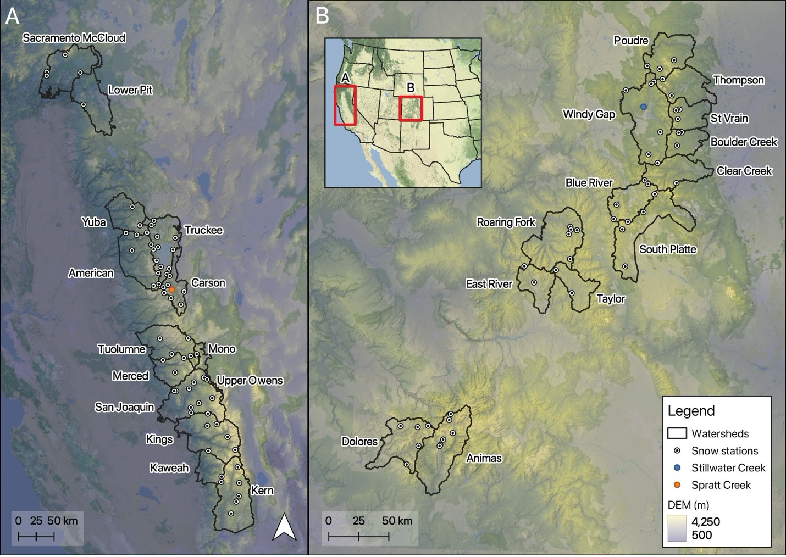
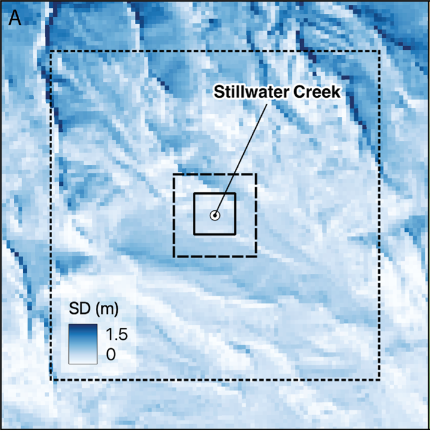
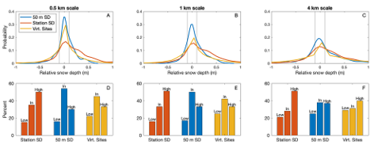
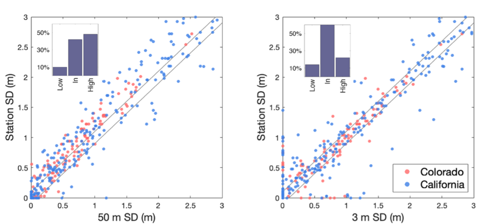
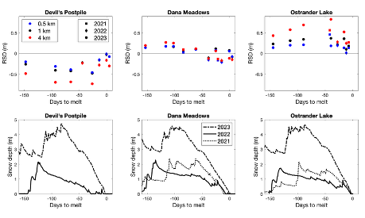

*This is a quick write-up of the first chapter of my dissertation,* [Reanalysing the spatial representativeness of snow depth at automated monitoring stations using airborne lidar data](https://tc.copernicus.org/articles/18/3495/2024/), published in *The Cryosphere*.

---

Any type of earth science modeling requires validation or *ground truth* to assess performance. Essentially, we need independent, high accuracy, measurements to see if the model is any good at what it’s supposed to be estimating.

In snow hydrology, that validation has traditionally relied on ground-based measurements, either collected manually or automatically at Snow-Telemetry (Snotel) stations. But there's a fundamental problem. Snow is extraordinarily variable over the landscape, and ground-based instruments measure a very limited area. A Snotel station measures snow water equivalent (SWE) at a 3×3 m footprint — yet the highest-resolution gridded snow datasets are typically 500 m resolution. To put that in perspective, about 27,000 Snotel stations could fit inside a single grid cell.

Despite this mismatch, Snotel observations are routinely used to validate modeled snow outputs. Snotel stations are highly accurate and temporally continuous, meaning they can validate a model on any given day of the year. But the underlying assumption that a point measurement represents the surrounding landscape is difficult to test.

**That's what this paper set out to do.**

---

## Using Lidar to Test Snotel Representativeness

To answer the question of how well Snotel stations represent the surrounding area, we used airborne lidar data collected by [Airborne Snow Observatories (ASO)](https://airborneobservatory.org/), a NASA JPL project that has since become a private company. ASO collects accurate, high-resolution snow depth data across entire watersheds, providing unprecedented levels of spatial detail.

It's worth noting that the availability of lidar doesn't make Snotel obsolete. Lidar surveys are expensive, snapshots of one moment in time, and collected only in select watersheds — mostly in California and Colorado. Snotel remains essential for continuous temporal monitoring, especially in areas without the resources to pay for expensive lidar surveys. 

Colorado and California fund extensive lidar sampling programs through ASO, and the figure below shows the basins with lidar coverage from 2021–2023, along with the locations of Snotel stations within those basins.

---

## How We Measured Representativeness

The approach was straightforward: calculate the mean snow depth in the area surrounding each Snotel station at several spatial scales, then compare that area-averaged value to what the station actually recorded. This effectively defines the expected error when using Snotel to validate a gridded model.

We assessed representativeness at three scales — 0.5, 1, and 4 km boxes centered on each station. The figure below shows an example at the Stillwater Creek Snotel site, with lidar-measured snow depth and the three comparison boxes overlaid.

---

## Results: Many Stations Are Not Representative

The general findings were unsurprising in one respect: some stations represent their surroundings well, and many do not. At the 0.5 km scale, only about one-third of stations fell within ±10 cm of the surrounding area snow depth, and this fraction decreases at larger scales.

The figure below summarizes results across all sites. The top panel shows the probability density function of the difference between each station and its surrounding area at the different scales, using three comparison approaches: the raw Snotel value, the nearest 50 m lidar point, and a randomly selected lidar point. The bottom panel summarizes the percentage of stations that are low, representative (within ±10 cm), or high relative to their surrounding area.

---

## An Unexpected Finding: Snotel Stations Are Systematically High

The more interesting result was a consistent directional bias. Snotel stations tend to record *higher* snow depths than the surrounding landscape. In the figure above, the red curve (Snotel) is systematically shifted high relative to the areal mean.

Crucially, this bias is reduced when we substitute the nearest 50 m lidar point instead of the Snotel value. This suggests either that Snotel stations are systematically placed in locations with deeper snow, or that something about the measurement setup itself produces a high bias.

To dig deeper, we compared three measurements at each location: the Snotel snow depth, the nearest 50 m lidar point, and the nearest 3 m lidar point. The Snotel value is consistently higher than the 50 m lidar point, but when compared to the 3 m lidar point directly beneath it, the bias largely disappears. This rules out instrument error as the primary explanation. Instead, it points to something about the *location* of Snotel stations on the landscape. Perhaps a tendency to locate them in sheltered, windward positions that accumulate more snow than the surrounding terrain.

---

## Biases Are Consistent Over Time

One final result stood out. The bias between a station and its surrounding area tends to be stable across years. The figure below shows relative snow depth at three stations across three water years. Two stations maintain a consistent directional bias throughout the season, while one shows a mid-season flip.

This interannual consistency is actually encouraging. Even if a Snotel station doesn't represent its surroundings in absolute terms, a stable bias can potentially be corrected — which would make Snotel a more reliable validation target for gridded models. In this paper we explored simple predictors like elevation and vegetation cover as correction factors, but none explained the bias well enough on their own.

That limitation leads directly into the second chapter of my dissertation, where we developed a machine learning approach to estimate snow depth relative to a Snotel station using a much richer set of predictors. 

---

*Questions or thoughts? Reach out at [jordan.herbert@colorado.edu](mailto:jordan.herbert@colorado.edu)*
